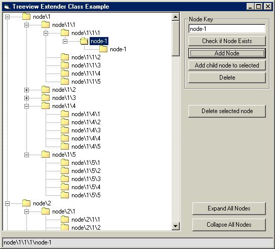



## TreeView Extender Class

### Description

Extends the treeview class to add some functionality that in my opinion should be there by default such as Exist and ExpandAll. If you have had trouble working with the Treeview Control in the past you might want to give this a look. I will be adding drag drop capability to this and beefinging up the OO code. If you have any suggestions please let me know. Enjoy - RegX
 
### More Info
 
vomiting, diareah, nausia, head-aches, muscle cramps and spasms. Out of the adults tested on 10% developed serious side effects, however all the animals tested on died. Use only under doctors strict supervision.

             |
---                |---
**Submitted On**   |2002-07-27 18:23:10
**By**             |[RegX](https://github.com/Planet-Source-Code/PSCIndex/blob/master/ByAuthor/regx.md)
**Level**          |Intermediate
**User Rating**    |5.0 (10 globes from 2 users)
**Compatibility**  |VB 6\.0
**Category**       |[VB function enhancement](https://github.com/Planet-Source-Code/PSCIndex/blob/master/ByCategory/vb-function-enhancement__1-25.md)
**World**          |[Visual Basic](https://github.com/Planet-Source-Code/PSCIndex/blob/master/ByWorld/visual-basic.md)
**Archive File**   |[TreeView\_E1114767272002\.zip](https://github.com/Planet-Source-Code/regx-treeview-extender-class__1-37319/archive/master.zip)

